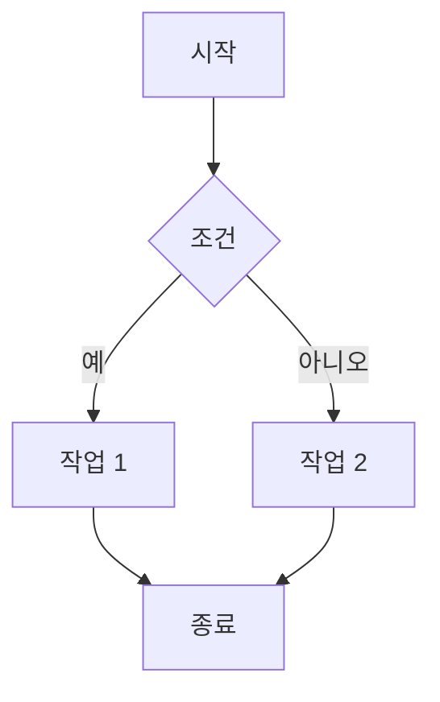
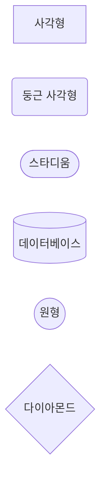
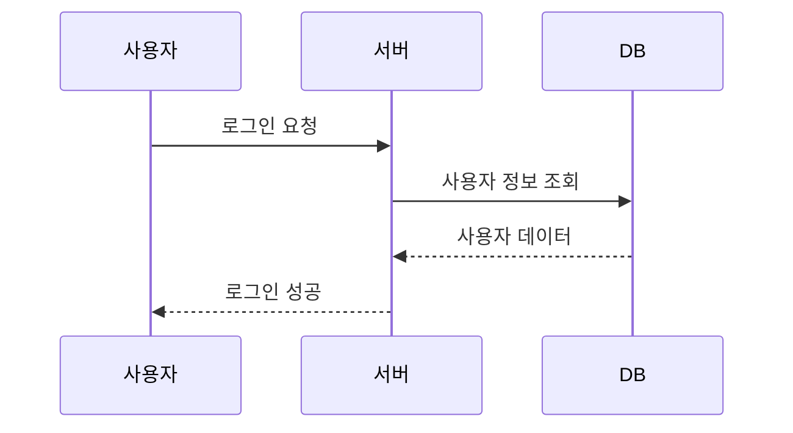
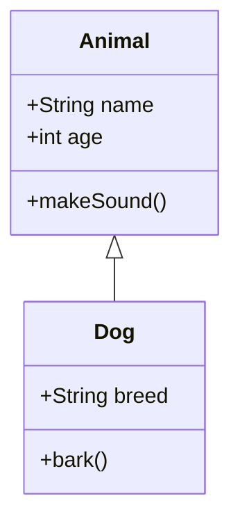
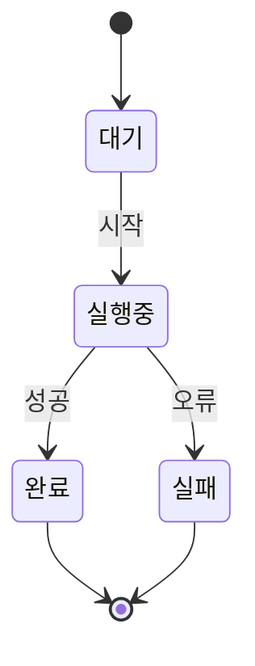
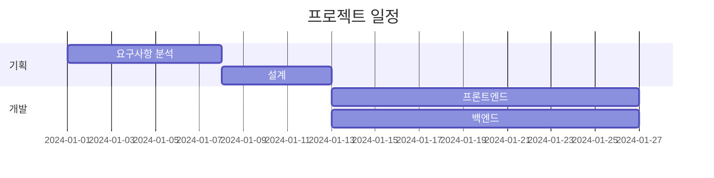
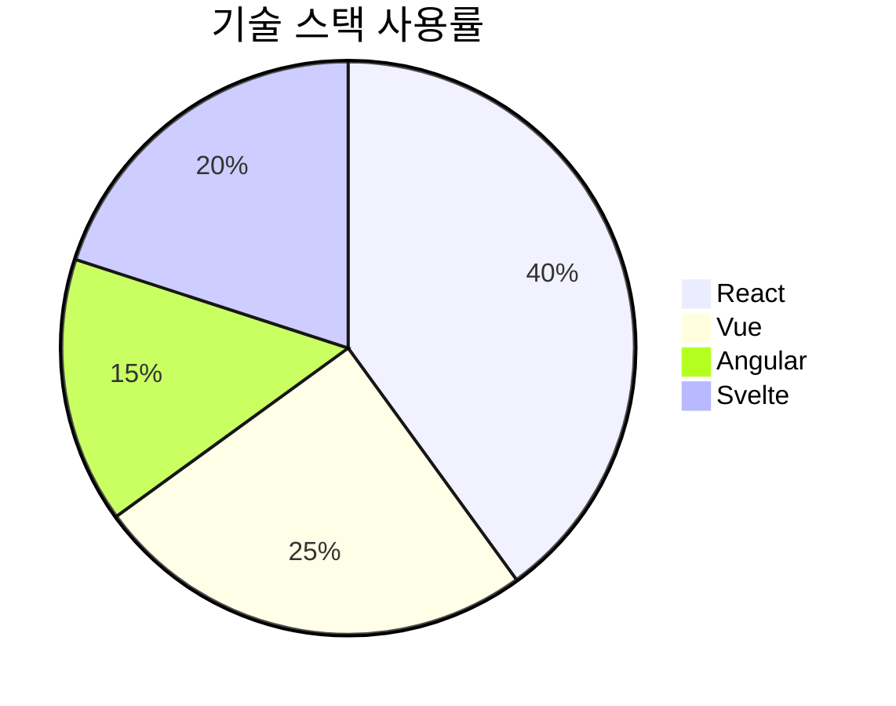
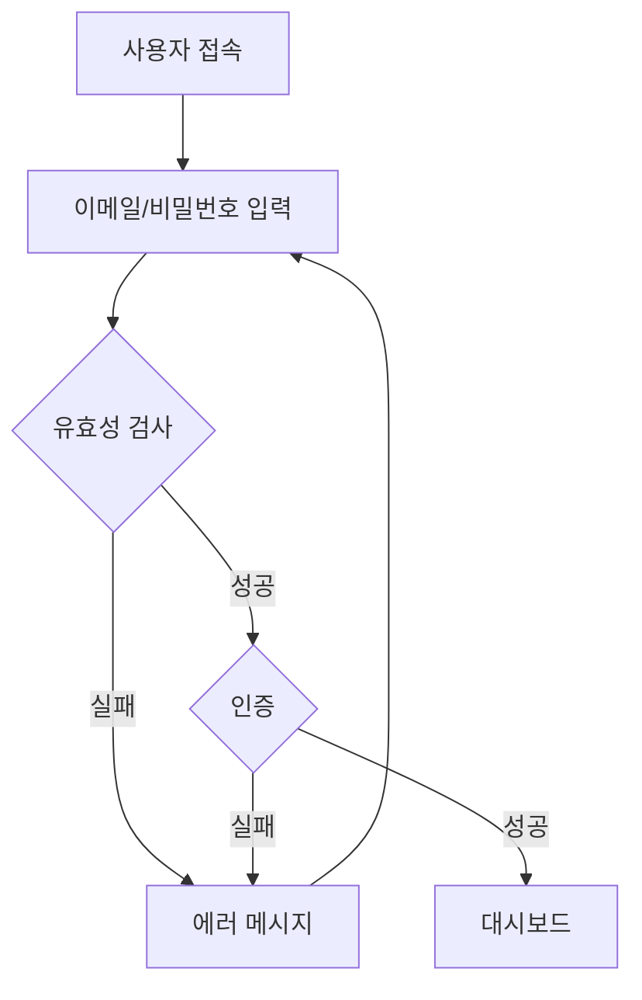
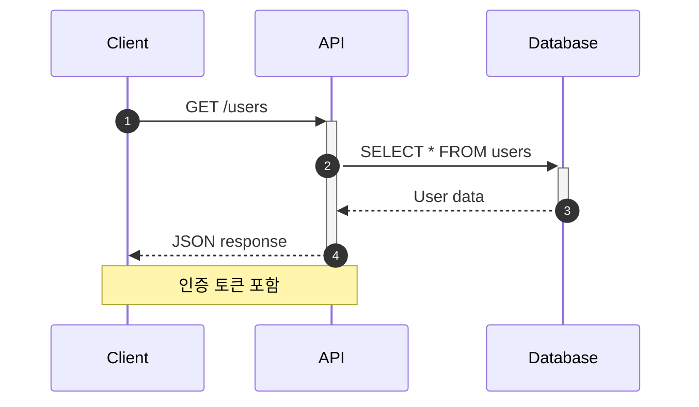

# 마크다운 문법 가이드

## 제목 (Headings)

# H1 제목
## H2 제목
### H3 제목
#### H4 제목
##### H5 제목
###### H6 제목

## 강조 (Emphasis)

*이탤릭체* 또는 _이탤릭체_

**볼드체** 또는 __볼드체__

***볼드 이탤릭*** 또는 ___볼드 이탤릭___

~~취소선~~

## 목록 (Lists)

### 순서 없는 목록

* 항목 1
* 항목 2
  * 하위 항목 2.1
  * 하위 항목 2.2
* 항목 3

### 순서 있는 목록

1. 첫 번째
2. 두 번째
3. 세 번째
   1. 하위 항목 3.1
   2. 하위 항목 3.2

### 체크박스 / 체크리스트 (Task Lists)

#### 기본 체크박스

- [x] 완료된 작업 (체크됨)
- [ ] 미완료 작업 (체크 안됨)
- [ ] 진행 중인 작업

#### 중첩된 체크박스

- [x] 메인 작업
  - [x] 하위 작업 1
  - [x] 하위 작업 2
  - [ ] 하위 작업 3
- [ ] 다음 메인 작업
  - [ ] 하위 작업 A
  - [ ] 하위 작업 B

#### 실전 예제: 프로젝트 진행 상황

**프론트엔드 개발**
- [x] 프로젝트 초기 설정
  - [x] React 프로젝트 생성
  - [x] TypeScript 설정
  - [x] ESLint & Prettier 설정
- [x] 컴포넌트 개발
  - [x] Header 컴포넌트
  - [x] Footer 컴포넌트
  - [ ] 사이드바 컴포넌트
- [ ] API 연동
  - [x] Axios 설치
  - [ ] API 클라이언트 작성
  - [ ] 에러 핸들링

**백엔드 개발**
- [x] 서버 구축
- [ ] 데이터베이스 스키마 설계
- [ ] API 엔드포인트 개발
- [ ] 테스트 작성

#### 특수 문자와 함께 사용

- [x] **볼드** 체크박스
- [x] *이탤릭* 체크박스
- [x] ~~취소선~~ 체크박스
- [x] `코드`와 함께 사용
- [x] [링크](https://example.com)와 함께 사용
- [ ] 이모지와 함께 :rocket:

#### 주의사항

```markdown
# 올바른 형식
- [x] 공백이 있어야 합니다
- [ ] 대괄호 사이에 공백

# 잘못된 형식
-[x] 대시와 대괄호 사이 공백 없음
- [x]공백 없음
- [X] 소문자 x만 인식됨 (대문자 X는 일부 렌더러에서 작동)
```

#### 동적 진행률 표시

작업 진행률: 7/12 완료 (58%)

- [x] 작업 1
- [x] 작업 2
- [x] 작업 3
- [x] 작업 4
- [x] 작업 5
- [x] 작업 6
- [x] 작업 7
- [ ] 작업 8
- [ ] 작업 9
- [ ] 작업 10
- [ ] 작업 11
- [ ] 작업 12

## 링크 (Links)

### 기본 링크 만들기

링크를 만드는 기본 문법입니다:

```markdown
[링크 텍스트](URL)
```

**예제**:
```markdown
[구글](https://www.google.com)
[GitHub](https://github.com)
[네이버](https://www.naver.com)
```

**결과**:

[구글](https://www.google.com)

[GitHub](https://github.com)

[네이버](https://www.naver.com)

### 제목이 있는 링크 (툴팁)

마우스를 올리면 툴팁이 표시됩니다:

```markdown
[링크 텍스트](URL "툴팁 제목")
```

**예제**:
```markdown
[구글](https://www.google.com "구글로 이동합니다")
[Next.js 문서](https://nextjs.org/docs "Next.js 공식 문서")
```

**결과**:

[구글](https://www.google.com "구글로 이동합니다")

[Next.js 문서](https://nextjs.org/docs "Next.js 공식 문서")

### 자동 링크

URL을 꺾쇠 괄호(`< >`)로 감싸면 자동으로 링크가 됩니다:

```markdown
<https://www.google.com>
<https://github.com>
<hello@example.com>
```

**결과**:

자동 링크: <https://www.google.com>

이메일: <hello@example.com>

### 참조 스타일 링크

긴 URL을 여러 번 사용할 때 유용합니다:

```markdown
여기는 [구글][google]이고, 여기도 [구글][google]입니다.

[MDN 문서][mdn]를 참고하세요.

[google]: https://www.google.com "구글 홈페이지"
[mdn]: https://developer.mozilla.org "Mozilla Developer Network"
```

### 같은 문서 내 링크 (앵커)

다른 섹션으로 이동하는 링크:

```markdown
[표 섹션으로 이동](#표-tables)
[각주 섹션으로 이동](#각주-footnotes)
[맨 위로](#)
```

**예제**:

[표 섹션으로 이동](#표-tables)

[각주 섹션으로 이동](#각주-footnotes)

### 이미지와 링크 조합

이미지를 클릭하면 링크로 이동:

```markdown
[](링크URL)
```

### 새 탭에서 열기

마크다운 자체로는 불가능하지만, HTML 사용 가능:

```html
<a href="https://www.google.com" target="_blank">구글 (새 탭)</a>
```

### 실전 예제

```markdown
공식 문서는 [Next.js 공식 사이트](https://nextjs.org)에서 확인하세요.

더 자세한 내용은 [React 문서](https://react.dev "React 공식 문서")를 참고하세요.

질문이 있다면 <support@example.com>으로 문의하세요.

이슈는 [GitHub Issues][issues]에 등록해주세요.

[issues]: https://github.com/username/repo/issues "이슈 페이지"
```

### 링크 작성 팁

1. **설명적인 텍스트 사용**: "여기를 클릭" 대신 "사용자 가이드 보기" 사용
2. **상대 경로 가능**: 같은 프로젝트 내 파일은 상대 경로 사용 가능
3. **특수 문자**: URL에 괄호가 있으면 `%28`, `%29`로 인코딩
4. **보안**: 외부 링크는 `https://` 사용 권장

## 이미지 (Images)

### 기본 이미지 삽입

이미지를 삽입하는 기본 문법입니다:

```markdown

```

**예제**:
```markdown

```

**결과**:


### 제목이 있는 이미지 (툴팁)

마우스를 올리면 툴팁이 표시됩니다:

```markdown

```

**예제**:
```markdown

```

**결과**:


### 이미지를 링크로 만들기

이미지를 클릭하면 링크로 이동:

```markdown
[](링크URL)
```

**예제**:
```markdown
[](https://github.com)
```

**결과** (이미지 클릭 시 GitHub로 이동):

[](https://github.com)

### 이미지 크기 조절

마크다운 자체로는 크기 조절이 불가능하지만, HTML 사용 가능:

```html


```

**예제**:
```html


```

**결과**:


### 이미지 정렬

HTML을 사용하여 이미지를 정렬할 수 있습니다:

```html
<div align="center">
  
</div>

<div align="right">
  
</div>
```

### 로컬 이미지 vs 외부 이미지

**로컬 이미지**:
```markdown


```

**외부 이미지**:
```markdown

```

### 실전 예제

```markdown
프로젝트 로고:


더 자세한 내용은 아래 이미지를 클릭하세요:

[](https://example.com/tutorial)

작은 아이콘:  텍스트와 함께
```

### 이미지 작성 팁

1. **대체 텍스트 필수**: 접근성을 위해 항상 대체 텍스트 작성
2. **설명적인 텍스트**: "이미지" 대신 "프로젝트 구조 다이어그램" 같이 구체적으로
3. **최적화된 이미지**: 웹용으로 압축된 이미지 사용 권장
4. **상대 경로**: 같은 프로젝트 내 이미지는 상대 경로 사용
5. **HTTPS 사용**: 외부 이미지는 보안을 위해 HTTPS URL 사용

## 인용문 (Blockquotes)

> 이것은 인용문입니다.
> 여러 줄로 작성할 수 있습니다.
>
> > 중첩된 인용문도 가능합니다.

## 코드 (Code)

### 인라인 코드

`const variable = "value"`

### 코드 블록

```javascript
function helloWorld() {
  console.log("Hello, World!");
  return true;
}
```

```python
def hello_world():
    print("Hello, World!")
    return True
```

```typescript
interface User {
  name: string;
  age: number;
}

const user: User = {
  name: "John",
  age: 30
};
```

## 표 (Tables)

### 기본 표 만들기

표를 만들려면 파이프(`|`)로 셀을 구분하고, 대시(`---`)로 헤더와 본문을 구분합니다.

```markdown
| 헤더1 | 헤더2 | 헤더3 |
|-------|-------|-------|
| 셀1   | 셀2   | 셀3   |
| 셀4   | 셀5   | 셀6   |
```

**결과**:

| 헤더1 | 헤더2 | 헤더3 |
|-------|-------|-------|
| 셀1   | 셀2   | 셀3   |
| 셀4   | 셀5   | 셀6   |

### 실전 예제

| 이름 | 나이 | 직업 | 월급 |
|------|------|------|----------:|
| 홍길동 | 30 | 개발자 | 5,000,000 |
| 김철수 | 25 | 디자이너 | 4,000,000 |
| 이영희 | 28 | 기획자 | 4,500,000 |

### 정렬된 표

콜론(`:`)을 사용하여 텍스트 정렬을 지정할 수 있습니다:

- `:---` → 왼쪽 정렬 (기본)
- `:---:` → 가운데 정렬
- `---:` → 오른쪽 정렬

```markdown
| 왼쪽 정렬 | 가운데 정렬 | 오른쪽 정렬 |
|:---------|:----------:|----------:|
| 왼쪽     | 가운데      | 오른쪽     |
| Left     | Center     | Right     |
```

**결과**:

| 왼쪽 정렬 | 가운데 정렬 | 오른쪽 정렬 |
|:---------|:----------:|----------:|
| 왼쪽 | 가운데 | 오른쪽 |
| Left | Center | Right |

### 표 만들기 팁

1. **파이프(`|`)는 필수**: 각 셀을 `|`로 구분해야 합니다
2. **구분선(`---`)은 필수**: 헤더와 본문을 구분하는 라인이 반드시 있어야 합니다
3. **공백은 자유롭게**: 보기 좋게 정렬해도 되고 안 해도 됩니다
4. **최소 3개의 대시**: `---` (더 많아도 상관없음)

### 간단한 표

```markdown
| A | B | C |
|---|---|---|
| 1 | 2 | 3 |
| 4 | 5 | 6 |
```

**결과**:

| A | B | C |
|---|---|---|
| 1 | 2 | 3 |
| 4 | 5 | 6 |

## 수평선 (Horizontal Rule)

---

***

___

## 이스케이프 (Escape)

\* 별표를 문자로 표시
\# 해시를 문자로 표시
\[ 대괄호를 문자로 표시

## 각주 (Footnotes)

### 기본 사용법

각주를 추가하려면 `[^식별자]` 형식을 사용합니다.

```markdown
여기에 각주를 추가합니다[^1].

다른 각주도 추가할 수 있습니다[^2].

여러 번 참조할 수도 있습니다[^1].

[^1]: 첫 번째 각주 내용입니다.
[^2]: 두 번째 각주 내용입니다.
```

**결과**:

문장에 각주를 추가할 수 있습니다[^1].

다른 각주도 가능합니다[^2].

같은 각주를 여러 번 참조할 수 있습니다[^1].

[^1]: 첫 번째 각주 내용입니다.
[^2]: 두 번째 각주 내용입니다.

### 작성 규칙

1. **각주 참조**: `[^식별자]` 형식으로 작성
2. **각주 정의**: `[^식별자]: 내용` 형식으로 작성
3. **위치**: 각주 정의는 문서 어디에나 작성 가능 (보통 섹션 끝이나 문서 끝에 작성)
4. **자동 정렬**: 각주는 자동으로 번호가 매겨지고 문서 하단에 정렬됩니다

### 실전 예제

```markdown
마크다운[^markdown]은 2004년 존 그루버가 만들었습니다[^creator].

이 문서는 GitHub Flavored Markdown[^gfm]을 지원합니다.

[^markdown]: 일반 텍스트 기반의 경량 마크업 언어
[^creator]: 존 그루버(John Gruber)와 아론 스워츠(Aaron Swartz)가 협업
[^gfm]: GitHub에서 확장한 마크다운 문법으로, 표, 체크박스 등을 지원합니다.
```

### 긴 각주 작성

여러 줄로 된 긴 각주도 작성할 수 있습니다:

```markdown
이것은 긴 각주입니다[^long].

[^long]:
    이것은 여러 줄로 된 각주입니다.

    단락도 포함할 수 있습니다.

    - 목록도 가능합니다
    - 여러 항목을 추가할 수 있습니다
```

### 식별자 종류

숫자가 아닌 식별자도 사용할 수 있습니다:

```markdown
마크다운[^about-md]은 매우 유용합니다[^useful-tool].

[^about-md]: 마크다운에 대한 설명입니다.
[^useful-tool]: 문서 작성에 매우 편리한 도구입니다.
```

### 참고사항

- ⚠️ **지원 여부**: 일부 마크다운 렌더러는 각주를 지원하지 않을 수 있습니다
- 각주 번호는 자동으로 생성됩니다
- 각주를 클릭하면 해당 정의로 이동합니다
- 각주 정의에서 돌아가기 링크도 자동으로 생성됩니다

## 정의 목록 (Definition Lists)

용어 1
: 정의 1

용어 2
: 정의 2a
: 정의 2b

## 줄바꿈 (Line Breaks)

첫 번째 줄
두 번째 줄 (공백 2개로 줄바꿈)

또는

첫 번째 줄<br>
두 번째 줄 (br 태그 사용)

## HTML 태그

<div align="center">
  <strong>중앙 정렬된 볼드 텍스트</strong>
</div>

<kbd>Ctrl</kbd> + <kbd>C</kbd>

<mark>하이라이트된 텍스트</mark>

## 이모지 (Emoji)

:smile: :heart: :thumbsup: :rocket: :fire:

## 수학 공식 (Math - GitHub 지원)

인라인 수식: $E = mc^2$

블록 수식:

$$
\frac{n!}{k!(n-k)!} = \binom{n}{k}
$$

## 다이어그램 (Mermaid)

Mermaid는 텍스트로 다이어그램을 그릴 수 있는 강력한 도구입니다.

### 기본 문법

````markdown
```mermaid
다이어그램 코드
```
````

### 1. 플로우차트 (Flowchart)

가장 기본적인 다이어그램입니다:

````markdown

````

**결과**:


#### 방향 지정

- `graph TD` - 위에서 아래 (Top Down)
- `graph LR` - 왼쪽에서 오른쪽 (Left Right)
- `graph BT` - 아래에서 위 (Bottom Top)
- `graph RL` - 오른쪽에서 왼쪽 (Right Left)

#### 노드 모양

````markdown

````

**결과**:



### 2. 시퀀스 다이어그램

시스템 간 상호작용을 표현:

````markdown

````

**결과**:


#### 화살표 종류

- `->` 실선 화살표
- `-->` 점선 화살표
- `->>` 실선 화살표 (채워진)
- `-->>` 점선 화살표 (채워진)

### 3. 클래스 다이어그램

객체지향 설계를 표현:

````markdown

````

**결과**:


### 4. 상태 다이어그램

상태 전환을 표현:

````markdown

````

**결과**:


### 5. 간트 차트

프로젝트 일정을 표현:

````markdown

````

**결과**:


### 6. 파이 차트

비율을 표현:

````markdown

````

**결과**:


### 실전 예제

#### 로그인 플로우



#### API 호출 시퀀스



### Mermaid 작성 팁

1. **들여쓰기**: 가독성을 위해 적절한 들여쓰기 사용
2. **노드 이름**: 공백이 있으면 따옴표로 감싸기
3. **한글 지원**: 한글도 완벽하게 작동합니다
4. **복잡도**: 너무 복잡하면 여러 개로 나누기
5. **미리보기**: [Mermaid Live Editor](https://mermaid.live)에서 테스트 가능
6. **방향**: 다이어그램이 복잡하면 LR(좌우)보다 TD(상하)가 더 보기 좋을 수 있음

## 접기/펼치기 (Details)

<details>
<summary>클릭해서 내용 보기</summary>

여기에 숨겨진 내용이 있습니다.

- 항목 1
- 항목 2
- 항목 3

</details>

## GitHub 특수 기능

### 멘션

@username

### 이슈/PR 참조

#123

### 커밋 참조

abc123def

### 알림/경고 블록

> [!NOTE]
> 유용한 정보입니다.

> [!TIP]
> 도움이 되는 팁입니다.

> [!IMPORTANT]
> 중요한 정보입니다.

> [!WARNING]
> 주의가 필요한 내용입니다.

> [!CAUTION]
> 위험한 내용입니다.

## 마크다운 베스트 프랙티스

1. 제목은 계층 구조를 유지하세요 (H1 > H2 > H3)
2. 코드 블록에는 언어를 명시하세요
3. 링크는 의미있는 텍스트를 사용하세요
4. 이미지에는 대체 텍스트를 추가하세요
5. 목록은 일관된 스타일을 사용하세요
6. 표는 가독성을 위해 정렬하세요
7. 긴 문서는 목차를 추가하세요

---

**마크다운 작성 완료!** :tada:
